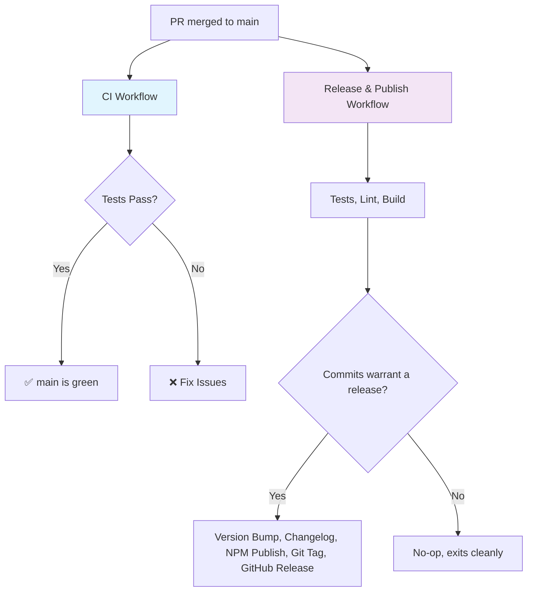

# GitHub Actions Workflows

This repository uses two GitHub Actions workflows for different purposes:

## 🔄 CI Workflow (`.github/workflows/main.yml`)

**Trigger**: Every push and pull request to `main`

**Purpose**: Continuous Integration testing

**Jobs**:
- **Test**: Runs tests on Node.js 20.x and 22.x
- **Security**: Runs security audit (production dependencies only)
- **Integration Tests**: Runs the test suite against the live CounterAPI

**What it does**:
- ✅ Installs dependencies
- ✅ Runs linting
- ✅ Runs type checking  
- ✅ Runs test suite with coverage
- ✅ Builds the project
- ✅ Uploads coverage to Codecov
- ✅ Runs security audit
- ✅ Runs integration tests against the live API

## 🚀 Release & Publish Workflow (`.github/workflows/release.yml`)

**Trigger**: Every push to `main` (i.e. every merged PR), or manual dispatch to retry a failed run

**Purpose**: Fully automated releases — no manual version bump or `npm publish` step. See [RELEASE.md](./RELEASE.md) for the full commit-message convention and troubleshooting.

**What it does**:
- ✅ Runs full CI pipeline (tests, linting, type checking, building) — release is skipped if any fail
- ✅ Analyzes commits since the last release ([Conventional Commits](https://www.conventionalcommits.org/)) via [semantic-release](https://semantic-release.gitbook.io/) to decide patch/minor/major/no-release
- ✅ Updates `CHANGELOG.md` and bumps `package.json`
- ✅ Publishes to the NPM registry
- ✅ Creates a git tag and GitHub Release with generated notes
- ✅ Commits the version bump back to `main` (`[skip ci]`, so it doesn't retrigger itself)

If nothing on `main` since the last release warrants a version bump (only `chore:`/`docs:` commits, say), the workflow runs and exits without publishing — that's expected, not a failure.

## Workflow Sequence

## Release Process

1. **Development**: Open a PR; CI runs lint/typecheck/test/build on every push.
2. **Merge to `main`**: The Release workflow runs automatically.
3. **Automatic Versioning**: semantic-release inspects the commit messages since the last release to decide the version bump (or that no release is needed).
4. **Complete Process**: A single workflow run handles versioning, changelog, NPM publish, and the GitHub release — no manual trigger required in the normal case.

## Benefits of This Structure

- **🔒 Separation of Concerns**: CI validates every push/PR; release only runs on `main`
- **🤖 Fully Automatic**: Merging a well-labeled commit is the only action needed to ship a release
- **📏 Consistent Versioning**: Version bumps are derived from commit messages, not human judgment calls made under release pressure
- **🛡️ Safety**: Tests, lint, typecheck, and build all gate the release before anything is published
- **📦 Complete**: Handles versioning, changelog, NPM, and GitHub releases together, atomically
